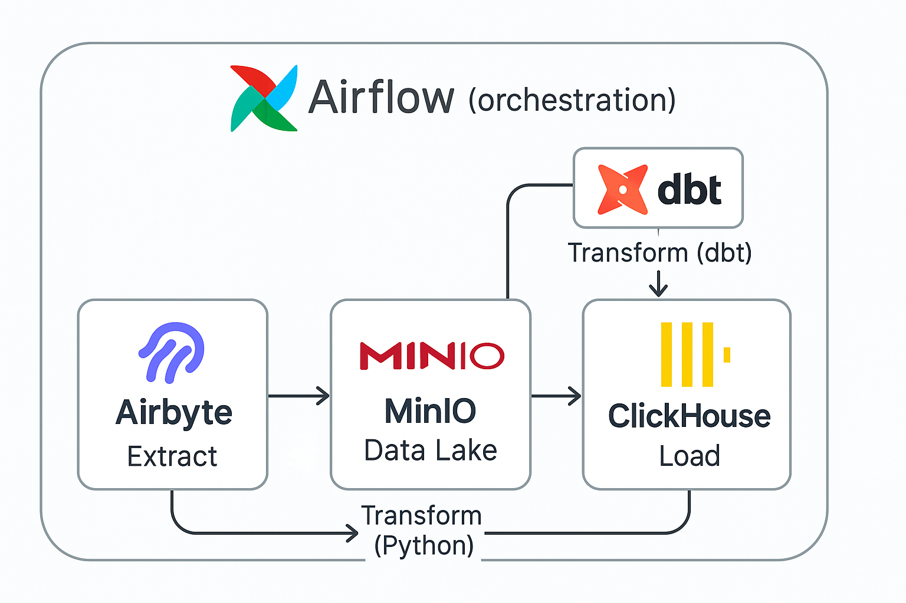
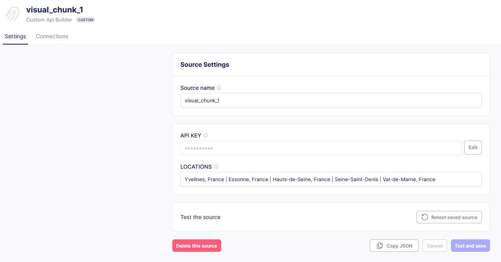
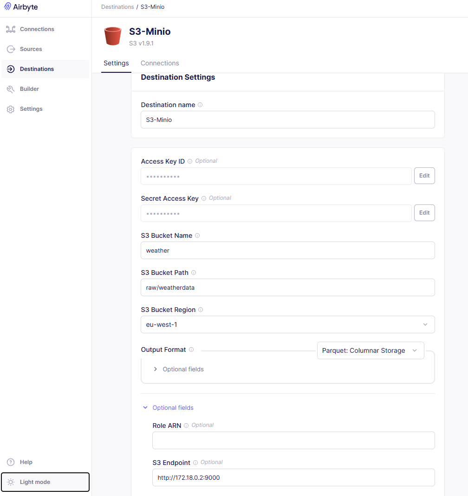
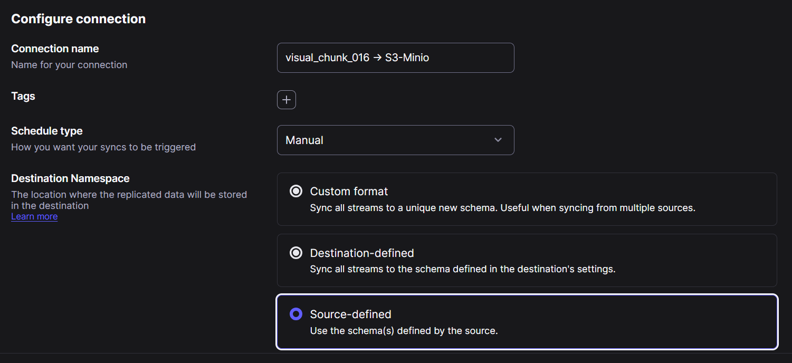
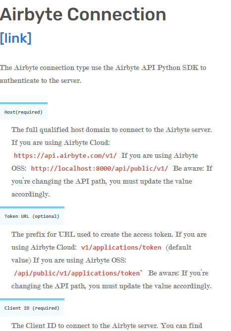

# **Deploy ETLT Infrastructure with Airbyte, Minio, Clickhouse, Dbt and Airflow**
[](https://airbyte.io/)
[](https://min.io/)
[](https://clickhouse.com/)
[](https://www.getdbt.com/)
[](https://fastapi.tiangolo.com/)
[](https://www.sqlalchemy.org/)
[](https://airflow.apache.org/)
[](https://www.python.org/)
[](https://www.postgresql.org/)
[](https://www.docker.com/)


This project sets up an analytics architecture using Docker containers for data extraction, storage, orchestration, and transformation.

- Airbyte (Extract) retrieves data from sources and deposits it into MinIO (Data Lake).
- In MinIO, an initial transformation (Python) is performed to clean or enrich the files.
- The data is then loaded (Load) from MinIO into ClickHouse, which is why "Load" appears under ClickHouse.
- Finally, dbt (Transform) runs SQL models that transform the data directly in ClickHouse to make it ready for analysis.




---

## Prerequisites

- **Docker**, **Docker Compose**, and **DBeaver** installed on your machine.
- Internet access to download required images.

---

## Included Services

- **Airbyte**: Data [integration](https://www.optimize-matter.com/blog/airbyte-la-plateforme-pour-le-transport-de-vos-donnees) tool, installed locally via Docker.
- **Minio**: Data lake for storing data extracted by Airbyte.
- **Airflow**: ETLT job orchestrator.
- **Clickhouse**: Data warehouse for analytics.
- **dbt**: Modular data transformation in the warehouse.

---

## Local Installation

### 1. **Airbyte Installation**

Airbyte is installed locally via Docker in this setup. For production or Kubernetes environments, refer to the [Airbyte OSS installation guide](https://docs.airbyte.com/platform/deploying-airbyte).

It's poossible to install it if you use a kubernetes cluster by using ``helm``. This option is handy when you want to install a specific version of airbyte.


Example Helm installation:


```bash
helm install \
  airbyte \
  airbyte/airbyte \
  --namespace airbyte \
  --values ./values.yaml
```

We might also use this fastest way to install a QuickStart Aribyte by following different steps explained on [Airbyte website](https://docs.airbyte.com/platform/using-airbyte/getting-started/oss-quickstart). Before that, make sure you've already installed Docker Desktop as explained on [Airbyte Site](https://docs.airbyte.com/platform/using-airbyte/getting-started/oss-quickstart?_gl=1*zn15cq*_gcl_au*MTQ5MTA1NjQ3MC4xNzIxMjM1NDcy#part-1-install-docker-desktop).

Once Airbyte is installed, the first step is to connect it to your weather API (e.g., VisualCrossing). You can use ``Airbyte's API connector builder`` for this purpose. Review the [`custom_api_builder.yaml`](airbyte/custom_api_builder.yaml) file for connection details—this file outlines the configuration needed to connect to the VisualCrossing API, including authentication and endpoint setup. You can recreate the connector using Airbyte's no-code interface or import this YAML file. Here is a breakdown of its [components](https://docs.airbyte.com/platform/connector-development/config-based/understanding-the-yaml-file/yaml-overview). You would adjust this file one based on your needs.

To configure the connector, you will need:
- **API Key** from your VisualCrossing account (that's important to note how to handle [AUTHENTICATION](https://docs.airbyte.com/platform/connector-development/connector-builder-ui/authentication)).
- **Base URL**: `https://weather.visualcrossing.com/VisualCrossingWebServices/rest/services/timelinemulti` (supports up to five locations per request for free accounts especially with the endpoint `timelinemulti`). See [VisualCrossing documentation](https://www.visualcrossing.com/resources/documentation/weather-api/using-the-timeline-weather-api-with-multiple-locations-in-the-same-request/) for details.
- **Locations**: Specify locations in the format `London,UK|Paris,France|Tokyo,Japan|Cape Town,South Africa`.
- **unitGroup**: metric, us,... metric option provides you for instances metrics used in France like ``°C, m, etc.``
For guidance on building custom API connectors, refer to the [Airbyte Connector Builder tutorial](https://docs.airbyte.com/platform/connector-development/connector-builder-ui/tutorial).

To ensure the compatibilty of each part of this project it is important to specifiy their relevant versions

Here the breakdown of each piece:

|Part | Version |
|------|------|
|abctl  |v0.30.1|
airbyte/connector-builder-server  |  1.8.0
airbyte/cron                   |     1.8.0
airbyte/workload-api-server    |      1.8.0
airbyte/worker                  |     1.8.0
airbyte/workload-launcher        |    1.8.0
airbyte/server                   |    1.8.0
altinity/clickhouse-server       |    24.8.14.10501.altinitystable-alpine
airbyte/db                      |     1.7.0-17
quay.io/minio/minio              |    latest (to freeze)
temporalio/auto-setup            |    1.27.2
clickhouse/clickhouse-server    |     23.7.4.5-alpine
altinity/clickhouse-server      |     21.8.10.1.altinitystable


In this project, ``multiple source connections`` are created—each handling a chunk of locations (to cover all 99 departments of metropolitan France)—with MinIO as the destination.

Airbyte supports S3-compatible storage, and MinIO works seamlessly with Amazon S3 APIs. To set up the destination:
- Obtain your MinIO endpoint URL, access key, and secret key.
- In Airbyte, select the S3-compatible destination connector and enter your MinIO details.
- Ensure your MinIO bucket has read/write permissions and encryption in transit is enabled.

It will be shown something like displayed below :

1. Define a source with Api Connector already created



2. Define a Minio destination (Note you have to add Airbyte into the Minio network as described in the script one [connect_airbyte_to_containers_network](scripts/connect_airbyte_to_containers_network.sh))



3. Define how to save data to the destination (``Manual Schedule type`` allows to ``Airflow`` to launch a sync to each connection)



If you encounter issues, consult the [Airbyte S3 destination documentation](https://docs.airbyte.com/integrations/destinations/s3) or reach out to the Airbyte community.


### 2. **Clone the repository**:
  ```bash
  git clone https://github.com/donat-konan33/EtltAirbyteMinioClickhouseDbtAirflow.git
  cd EtltAirbyteMinioClickhouseDbtAirflow
  ```

### 3. **Start the infrastructure**:
  ```bash
  docker compose up -d
  docker compose -f docker-compose-minio-clickhouse up -d
  ```

### 4. **Access web interfaces**:
  - Airbyte: [http://localhost:8000](http://localhost:8000)
  - Minio: [http://localhost:9002](http://localhost:9002)
  - Airflow: [http://localhost:8080](http://localhost:8080)
  - Clickhouse: [http://localhost:8123](http://localhost:8123)

### 5. **Connect to** **Clickhouse** using **DBeaver** to view or checkout the DBT transformations achieved.

Before connecting to Clickhouse with Dbeaver, ``database`` you would reach must have been created, Otherwise it will connect to the ``default db``. You could have need to set `user` and `password`.
general settings have to be : ``Host:localhost`` and ``port : 8123``

---

# Airflow Connection and parameters

To connect to airbyte with airflow it is necessarly to note these informations as explained on airflow reference:

1. With ``Airbyte`` connection type:


There is stuff showing how to [get, post or simply interact](https://reference.airbyte.com/reference) with airbyte server api.

To customize an airbyte deployment do see this [link](https://docs.airbyte.com/platform/contributing-to-airbyte/developing-locally) one.

2. With http ``Http`` connection type:


3. Some [relevant alternatives](https://airbyte.com/blog/orchestrating-airbyte-api-airbyte-cloud-airflow)


Note we are capable to automate custom APIs building along with sources and destinations. See here for [more](https://reference.airbyte.com/reference/createdestinationdefinition).

```
script/airbyte_relevant_executable.sh
```

We use ``airflow version 3.0.1`` and some configs have been modified like users creating along with others.
Users config are now managed by simple_auth_passwords.json file you can find and have a look [here](airflow/config/simple_auth_passwords.json) to see what it is. We are also have interesting [reference](https://airflow.apache.org/docs/apache-airflow/stable/howto/docker-compose/index.html) about airflow running in Docker.


### Airflow [concept](https://airflow.apache.org/docs/apache-airflow/1.10.9/concepts.html)

Fernet code  :
```
# poetry add fernet
python -c "from cryptography.fernet import Fernet; print(Fernet.generate_key().decode())"
```


You can download docker-compose.yaml content example to create from scratch your own architecture based on [airflow:3.0.1](https://airflow.apache.org/docs/apache-airflow/3.0.0/docker-compose.yaml)

---
## Notes

This project is under development.
Refer to each service's documentation for more details.
It is important to create a local `.env` file with the same contents as `.env.example`.

If you have questions or need clarification about any part of this setup, feel free to reach out for assistance.


## Clickhouse table optimization

### **Understanding ClickHouse Engines and Their Semantics**

When working with ClickHouse, it is essential to understand the different table engines and their behavior, as well as how sorting keys affect data storage.

**Common Engines:**

MergeTree → does not guarantee uniqueness of rows.

ReplacingMergeTree → keeps only the latest version of a record based on a defined version column.

CollapsingMergeTree → allows insertion of rows with a sign column (+1 / -1) to represent row states and collapse them accordingly.

ReplicatedCollapsingMergeTree → same as CollapsingMergeTree, but supports replication across multiple nodes.

VersionedCollapsingMergeTree → similar to CollapsingMergeTree, but with a version column to resolve conflicts.

SummingMergeTree → automatically aggregates numeric columns during merges based on the sorting key.

### **Sorting keys in ClickHouse**

ORDER BY tuple() → no indexing on insertion, faster inserts.

ORDER BY (col1, col2, ..., colN) → creates an index on the specified columns, improving query performance but making inserts slightly slower.

### **Important Notes**

The sorting key in ClickHouse behaves somewhat like a primary key in transactional databases, but it does not enforce uniqueness.

In many cases (e.g., appending tweets to a table), data is simply inserted as new rows instead of being updated in place.

We may have to append data into table as for adding tweet, we should put data like that:

```
tweet_to_record = models.Tweet(**tweet.dict(), owner_id=user_id)
db.add(tweet_to_record)
db.commit()
db.refresh(tweet_to_record)

```

but it is not the case here, we just **query** table for the moment, our api does not allow it.

So What We eventually use looks like : ``db.query(models.Tweet).offset(skip).limit(limit).all()``, Where db is the database connection Session.


## Environment Variables

Here are variables you need for this project by refering to [`.env.example`](.env.example):

| Variable                   | Description                                               |
|----------------------------|-----------------------------------------------------------|
| **API_KEY**                | VisualCrossing API KEY needed to fetch weather data       |
| **MINIO_USER_NAME**        | Username for MinIO user                                   |
| **MINIO_USER_PASSWORD**    | Password for MinIO user                                   |
| **AWS_ACCESS_KEY_ID**      | AWS access key, set from MinIO username                   |
| **AWS_SECRET_ACCESS_KEY**  | AWS secret key, set from MinIO password                   |
| **MINIO_HOST**             | Host address for MinIO server                             |
| **MINIO_API_PORT**         | Internal port for MinIO API                               |
| **CLICKHOUSE_DB**          | Name of ClickHouse database                               |
| **CLICKHOUSE_USER**        | Username for ClickHouse                                   |
| **CLICKHOUSE_PASSWORD**    | Password for ClickHouse user                              |
| **CLICKHOUSE_HOST**        | Host address for ClickHouse server                        |
| **CLICKHOUSE_HOSTNAME**    | Hostname for ClickHouse server                            |
| **POSTGRES_PASSWORD**      | Password for PostgreSQL user                              |
| **POSTGRES_USER**          | Username for PostgreSQL                                   |
| **POSTGRES_DB**            | Name of PostgreSQL database                               |
| **POSTGRES_HOST**          | Host address for PostgreSQL server                        |
| **HOST**                   | Host address for Airbyte server                           |
| **AIRBYTE_URL**            | URL for Airbyte instance                                  |
| **AIRBYTE_USER**           | Username for Airbyte                                      |
| **AIRBYTE_PASSWORD**       | Password for Airbyte user                                 |
| **LAKE_BUCKET**            | Name of first lake bucket for Airflow if Airflow Variable |
| **AIRFLOW_ADMIN_EMAIL**    | Email address for Airflow admin user                      |
| **AIRFLOW_ADMIN_USERNAME** | Username for Airflow admin user                           |
| **AIRFLOW_ADMIN_PASSWORD** | Password for Airflow admin user                           |
| **AIRFLOW_ADMIN_FIRST_NAME**| First name of Airflow admin user                         |
| **AIRFLOW_ADMIN_LAST_NAME** | Last name of Airflow admin user                          |
---
